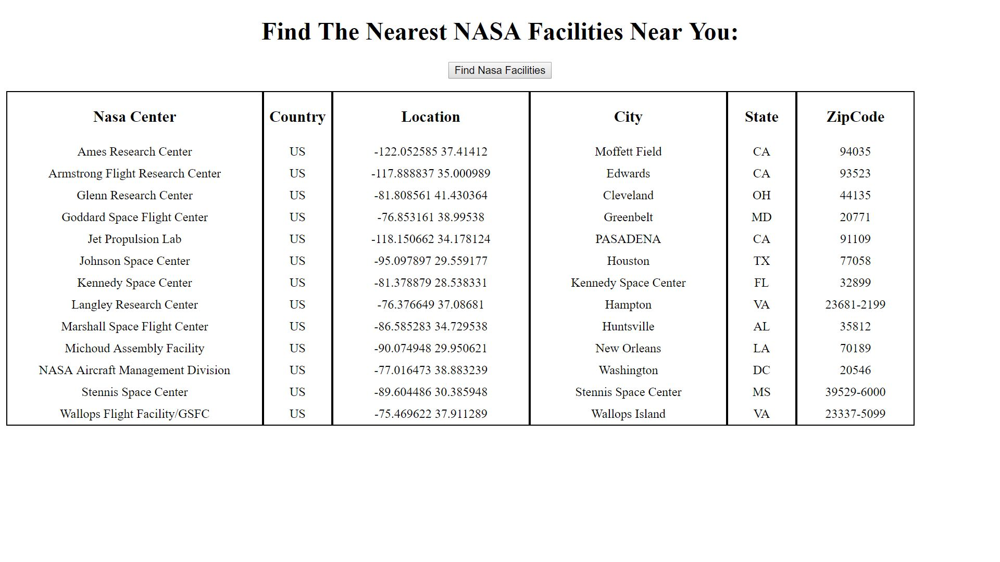

Nasa Facilities API
This project allows you to find the nearest Nasa facilities near you and displays the country, gps coordinates, city, state, and zip code for each center.

Link to project:

How It's Made:
Tech used: HTML, CSS, JavaScript, jQuery, API's

An ajax request is made to the url of the API and if it successful the function is ran. The function appends or adds the parameters that we want to an unordered list those properties we added to lists were the center, country the center was in, gps coordinates of the location, city, state, and zip code. This was done by looking at the API and seeing what properties it had and what properties we wanted from it we ended up. After that we were getting multiple listings for the same center so we decided to eliminate that by using an if statement to say if it was the last-child add that to the ul as the center and any other instances do not add.

Lessons Learned:
I learned how to not display the same center in my document multiple times. Some centers would be displayed numerous times so I had to write an if statement that appended only the last-child for centers, if it was a center that wasn't the last instance it wouldn't be displayed.

Examples:
Take a look at these couple examples that I have in my own portfolio:
